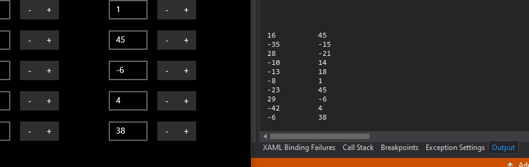
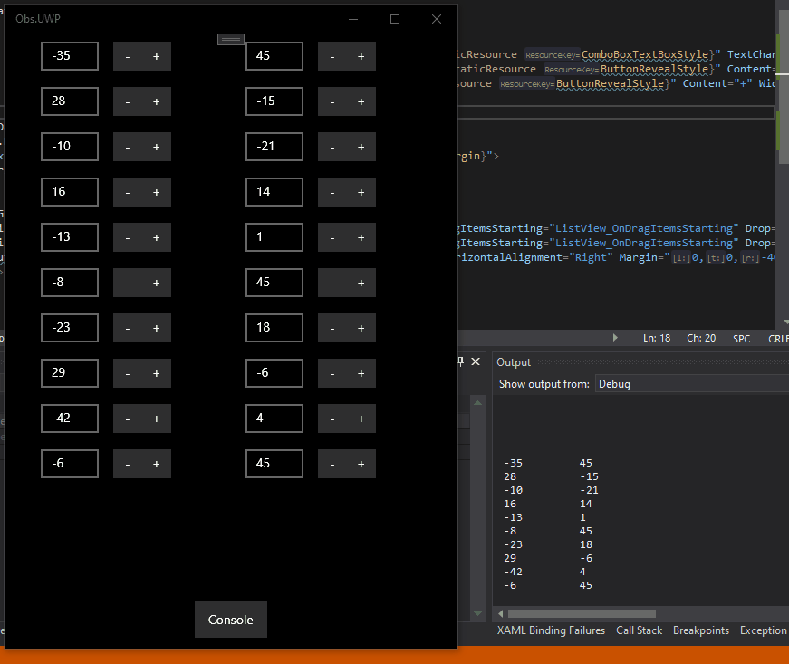
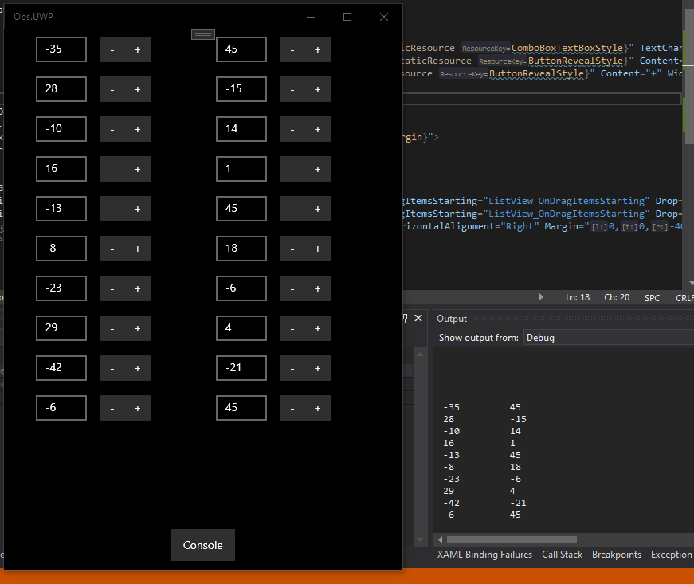
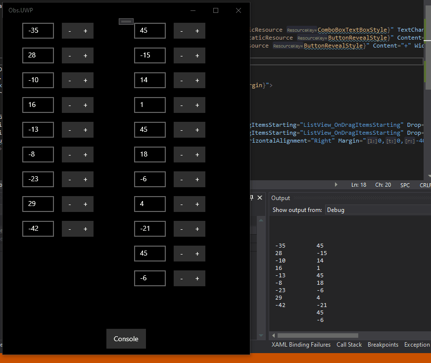

# ObservableCollection\<T>
### Use case
- ObservableCollection se používá v případě, že potřebuju nějaký seznam zobrazit v uživatelském prostředí
- Pod kapotou se jedná o Collection\<T>
### OC\<T> vs. Collection\<T>
- ObservableCollection\<T> implementuje interfacy INotifyCollectionChanged a INotifyPropertyChanged.
- Díky tomu se změny v seznamu projeví v uživatelském prostředí **okamžitě**, **rychle** a **levně**
### Použití
- V modelu je potřeba implementovat interface [INotifyPropertyChanged](https://docs.microsoft.com/en-us/dotnet/api/system.componentmodel.inotifypropertychanged?view=netcore-3.1). viz [Number.cs](https://github.com/reagcz/ObsColDemo/blob/master/Obs.UWP/Models/Number.cs)
- Ve ViewModelu vytvořím ObservableCollection, viz [MainViewModel.cs](https://github.com/reagcz/ObsColDemo/blob/master/Obs.UWP/ViewModels/MainViewModel.cs)
- V code behind části View nastavím DataContext na svůj ViewModel. [MainPage.xaml.cs](https://github.com/reagcz/ObsColDemo/blob/master/Obs.UWP/Views/MainPage.xaml.cs)
- Ve View můžu seznamy používat pomocí {x:Bind ViewModel...}
- **Přesný postup se liší podle frameworku (V tomhle repu je WPF i UWP)**, ale princip je stejný

### Užitečnost
- **Všechny akce se seznamem mohou být Read-Write**
- **Pro demonstraci je vpravo dole průběžný výstup do konzole namapovaný na vstupní seznamy**
#### Okamžité změny
- Všechno se po změně samo aktualizuje

#### Jednoduché řazení
- Jednoduše můžeme měnit pořadí položek, opět read-write

#### Drag & Drop
- Protože se všechno aktualizuje samo, nemusím nic řešit když chci drag & drop

#### Two-Way Binding
- Vstupní prvek můžu namapovat na proměnou a uživatel může seznam přímo upravovat.

